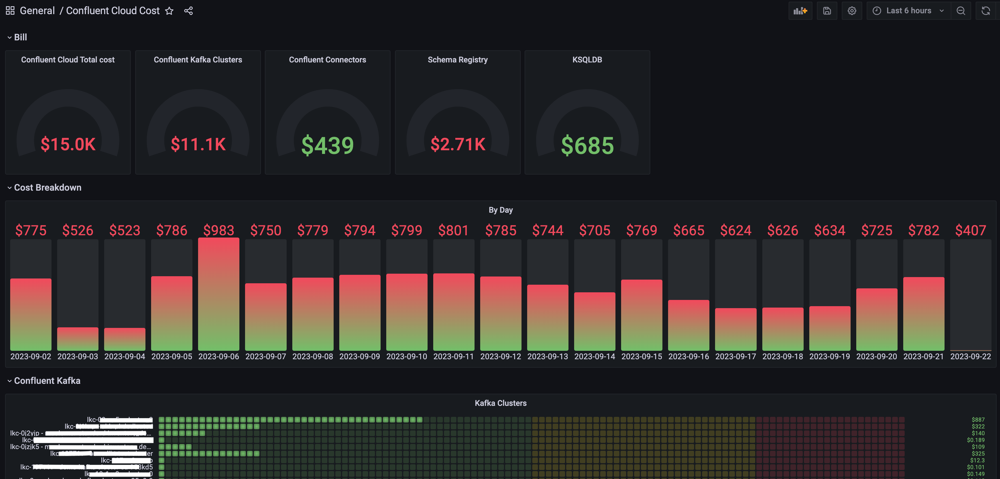
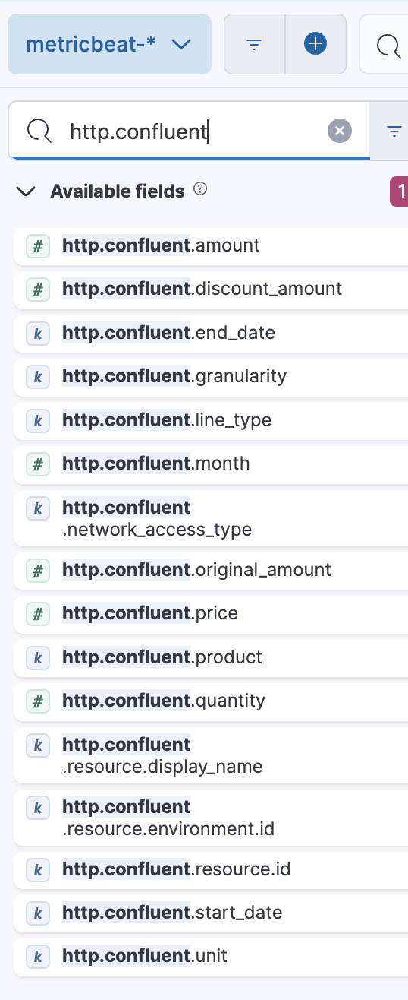
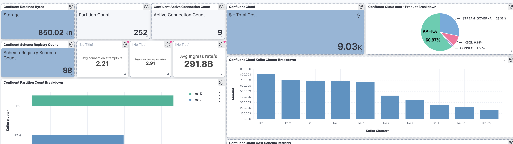

# Confluent Cloud Cost Exporter

This project integrates Confluent Cloud Cost information as another Confluent cloud metric to help on data aggregation related to service usage or cost breakdowns.

* [Confluent Cloud Metrics API](https://docs.confluent.io/cloud/current/metrics-api.html) provides metrics for Confluent Cloud resources, supports [Prometheus](https://prometheus.io) `export` and filtering by `resource`.

* [Confluent Cloud Costs API](https://docs.confluent.io/cloud/current/billing/overview.html) provides costs for Confluent Cloud resources.

[Confluent Costs API considerations](https://docs.confluent.io/cloud/current/billing/overview.html#retrieve-costs-for-a-range-of-dates):

* Cost data can take up to *72* hours to become available
* Start date can reach a maximum of one year into the past
* One month is the maximum window between start and end dates.
  
**Confluent Cloud cost exporter** is a web server that exposes the Confluent Cloud Costs API as Prometheus metrics or JSON Metrics for Metricbeat. 
Confluent Cloud costs exporter uses an internal cache to reduce the number of requests to Confluent Cloud API, cache expiration configuration needs to be used to define the request frequency to Confluent Cost API, bigger cache expiration time means less external calls. Prometheus works better with `scrape_interval` congigured with less than `5m`, but the cost data do not change so frequently, the costs exporters use the cache to serve data to Prometheus or Metricbeat. On the other side, the JSON exporter helps on data types normalization, avoiding the `Try to convert long to float` Elasticsearch error when tried to use Metricbeat HTTP module with Confluent Cloud API endpoint.  
A given period is required for building the query to the Cost API endpoint, the exporter is using the current Month to build the period(current month start date and current month end date define the period). Additionally, Confluent Cloud cost exporter can be configured to act as a CRON job to push costs to a given target. 

Supported CRON targets:

* Confluent Cloud Kafka Topic with AVRO.

## Source

`./confluent_cost_exporter` [Readme.md](confluent_cost_exporter/README.md)

Needs Confluent Cloud credentials to retrieve costs. Service account must be a member of the *OrganizationAdmin* role.

[More information](https://docs.confluent.io/cloud/current/billing/overview.html#retrieve-costs-for-a-range-of-dates)

Environment variables:

* `CONFLUENT_CLOUD_API_KEY` - Confluent Cloud API Key
* `CONFLUENT_CLOUD_API_SECRET` - Confluent Cloud API Secret

## Exporters

### Web exporter

Default exporter is the web exporter, it will expose cost information in the following endpoints:

* `/probe`: Confluent Cloud Cost as [prometheus](https://prometheus.io/)
* `/json`: Confluent Cloud Cost as [json](https://www.json.org/json-en.html)

Configure cache expiration. Default: `30m`

* `CACHE_EXPIRATION` - Cache expiration time. Default: `30m`  

#### Prometheus & Grafana

Prometheus interval is set to `5m` and timeout to `30s`. More than a `5m` interval is not recommended for Prometheus.

`prometheus.yml` file is configured to scrape metrics from Confluent Cloud Metrics API and from Confluent Cloud Cost exporter.

```yaml
 - job_name: Confluent Cloud
    scrape_interval: 1m
    scrape_timeout: 1m
    honor_timestamps: true
    static_configs:
      - targets:
        - api.telemetry.confluent.cloud
    scheme: https
    basic_auth:
      username: <CONFLUENT_API_KEY>
      password: <CONFLUENT_API_SECRET>
    metrics_path: /v2/metrics/cloud/export
    params:
      resource.kafka.id:
        - lkc-<id>
      resource.schema_registry.id:
        - lsrc-<id>
```

Getting Confluent cloud cost as Prometheus Metric, `confluent_cloud_cost_amount` with labels:

Example:

```txt
# HELP confluent_cloud_cost_amount Confluent Cloud Resource costs
# TYPE confluent_cloud_cost_amount untyped
confluent_cloud_cost_amount{discount="0",end_date="2023-10-02",environment="env-xxxxxx",granularity="DAILY",id="lkc-xxxxxx",original_amount="0",price="0.0001326",product="KAFKA",quantity="2.6151538e-05",resource="connect",start="2023-10-01",unit="GB-hour"} 0
confluent_cloud_cost_amount{discount="0",end_date="2023-10-02",environment="env-xxxxxx",granularity="DAILY",id="lkc-xxxxxx",original_amount="3.1368",price="0.00484",product="KAFKA",quantity="648",resource="connect",start="2023-10-01",unit="Partition-hour"} 3.1368
```

Prometheus Job:

```yaml
  - job_name: confluent_cost_exporter
    scrape_interval: 5m
    scrape_timeout: 30s
    honor_labels: true 
    metrics_path: /probe  
    static_configs:
      - targets: ['confluent_cost_exporter:7979'] 
```

##### Targets

Validate Targets are up.

Open `http://localhost:9090/targets?search=`

##### Grafana datasource

Provisioned datasource: (`./grafana/datasources/datasource.yml`)

##### Dashboards

Open `http://localhost:3000` and login as admin.

Provisioned dashboards: (`./grafana/dashboards`)

* Confluent Cloud.
  
* Confluent Cloud Cost.  
  


#### Metricbeat and Elasticsearch

MetricBeat and Elasticsearch: It is possible to use *Metribeat HTTP module* to get the data from Confluent Cloud Costs API, but it requires to manage type conversions defining an Elasticsearch index template.

**Issue**: Metricbeat HTTP module. `Try to convert long to float`.

* Metricbeat will try to insert into Elasticsearch `quantity: 20` as long.
  
* Metricbeat will try to insert into Elasticsearch `quantity: 10.4` as float.
  
Confluent Cloud Cost exporter will convert the `quantity` to float, forcing the `quantity` to be a float number always serialized with dot `.` as decimal separator.

`mtericbeat.yml` file is configured to collect metrics from Confluent Cloud Metrics API and send them to Elasticsearch.

Confluet Cloud Metrics:

```yml
metricbeat.modules:
 - module: prometheus
    period: 900s 
    hosts: ['https://api.telemetry.confluent.cloud/v2/metrics/cloud/export?resource.kafka.id=lkc-q8dr5m&resource.kafka.id=lkc-12771v&resource.schema_registry.id=lsrc-nvmj2d']
    fields_under_root: true
    username: <CONFLUENT_CLOUD_API_KEY>
    password: <CONFLUENT_CLOUD_API_SECRET>
```

Confluent Cloud Cost as Metricbeat metric.

```yml
metricbeat.modules:
  #------------------------- Confluent Cloud Cost Collector Module --------------------- 
  - module: http
    period: 5m 
    metricsets:
     - json
    hosts: ['http://confluent_cost_exporter:7979']
    namespace: "confluent"
    path: "/json" 
    method: "GET"
    json.is_array: true
```



##### Dashboards

Import Kibana dashboards:

* Confluent Cloud Metrics & Costs: `confluent_cloud_metrics_costs.ndjson`

TODO: Auto-provision Kinana dashboards.



#### Run

Define required environment variables at `docker-compose.yaml` file.

Confluent Cloud Cost exporter:

```yml
environment:
    - CONFLUENT_CLOUD_API_KEY=<CONFLUENT_CLOUD_API_KEY>
    - CONFLUENT_CLOUD_API_SECRET=<CONFLUENT_CLOUD_API_SECRET>
    - CACHE_EXPIRATION=240m
```

#### Prometheus & Grafana

1) Copy or rename `docker-compose-pg.yaml` to `docker-compose.yml` to start Prometheus, Grafana and the Confluent Cost exporter.

2) Edit `docker-compose.yml` and fill the required environment variables.

3) Create a `env` folder, compose file will mount `env` folder for managing services configuration:

4) Create `env/prometheus.yml` for Prometheus jobs configuration. (use `prometheus/prometheus-template.yml` as reference)  
  
5) Build: `docker-compose build`

6) Up: `docker-compose up -d`

#### Metricbeat & Elasticsearch

1) Copy `docker-compose-elk.yaml` to `docker-compose.yml` to start Elasticsearch, Kibana, Metricbeat and the Confluent Cost exporter.

2) Edit `docker-compose.yml` and fill the required environment variables.

3) Create a `env` folder, compose file will mount `env` folder for managing services configuration:

4) Create `env/metricbeat.yml` for Prometheus jobs configuration. (use `metricbeat/metricbeat-template.yml` as reference)  

5) Build: `docker-compose build`

6) Up: `docker-compose up -d`

## CRON Exporters

Enabling CRON exporters will run the exporters as CRON jobs, web exporters configuration will be ignored.

### Cron Job configuration

Environment variable:

* **`CRON_EXPRESSION`**=<CRON_EXPRESSION>
  
### Target: Confluent Cloud Kafka Topic

Environment variables:

* **`BOOTSTRAP`**=<CONFLUENT_CLOUD_BOOTSTRAP_SERVER>
* **`CONFLUENT_CLOUD_API_KEY`**=<CONFLUENT_CLOUD_API_KEY>
* **`CONFLUENT_CLOUD_API_SECRET`**=<CONFLUENT_CLOUD_API_SECRET>
* **`TOPIC`**=<TOPIC_NAME>
* **`SCHEMA_REGISTRY_ENDPOINT`**=<SCHEMA_REGISTRY_ENDPOINT>
* **`SCHEMA_REGISTRY_API_KEY`**=<SCHEMA_REGISTRY_API_KEY>
* **`SCHEMA_REGISTRY_API_SECRET`**=<SCHEMA_REGISTRY_API_SECRET>

Using a configuration file:

```yaml
credentials: 
  key: <CONFLUENT_CLOUD_API_KEY>
  secret: <CONFLUENT_CLOUD_API_SECRET>
cron:
  expression: "<CRON_EXPRESSION>" 
  target:
    kafka:
      bootstrap: <BOOTSTRAP_SERVER>
      credentials: 
        key: <CONFLUENT_CLOUD_KAFKA_API_KEY>
        secret: <CONFLUENT_CLOUD_KAFKA_API_SECRET>
      schemaRegistry:
        endpoint: <SCHEMA_REGISTRY_ENDPOINT>
        credentials:
          key: <SCHEMA_REGISTRY_API_KEY>
          secret: <SCHEMA_REGISTRY_API_SECRET>
      topic: <TOPIC_NAME>
```

#### Docker

Using a configuration file:

```sh
docker run -p 7979:7979 -v <path/to/config.yml>:/bin/config.yml confluent/confluent_cloud_cost_exporter 
```
  
## TODOs

* [ ] Grafana. Add more Panels to the dashboards
* [ ] Grafana. Combine Metrics and Costs in the same dashboard  
* [ ] Auto-provision Kinana dashboards.
* [ ] Alerting
* [ ] Exporters
